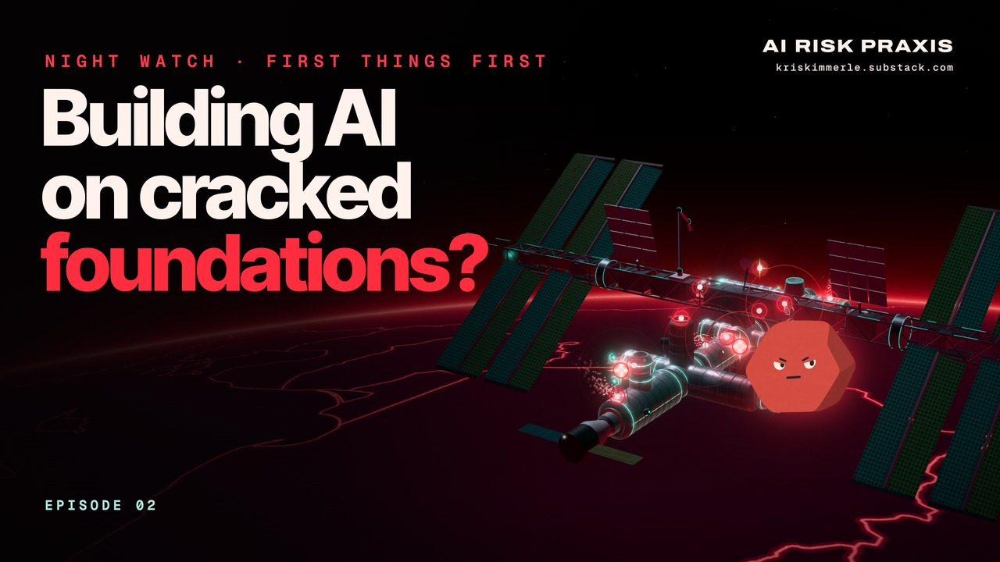

# NIGHT WATCH

Short motion films on AI and security, from [AI Risk Praxis](https://kriskimmerle.substack.com).

The films move fast. This repo is the slow version: each episode has its own folder with the citations for every real-world event and number on screen, mapped to the video's timestamps, plus a short take on what each moment is getting at and what to follow next.

## Episodes

| | Episode |
|---|---|
|  | **[01 · Sleeping Giants](01-sleeping-giants/)** 6:40 · Where we stand with AI and security: attacks got cheaper, the incidents piled up, and most companies are still asleep. |
|  | **[02 · First Things First](02-first-things-first/)** 4:05 · The AI attacks in the news still get in the old way. The foundations still work, and AI makes them matter more than ever. |

## How the pages work
- Every claim on screen is listed at its timestamp, with links to the primary sources wherever they exist.
- Labels mark sources with an interest: [SELF] is a company describing its own work, and [VENDOR] is a security firm that sells related products.
- The characters, buildings, stations and swarms are illustrations. The incidents and numbers are real.

Spotted an error or a better source? Open an issue.
